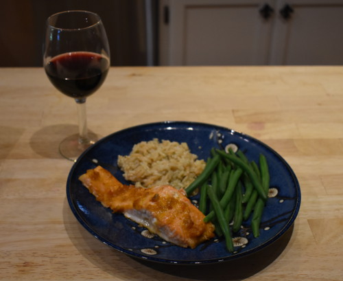

# Cooking with Concurrency

Working with coroutines is a lot like using recipes in cooking, so to explain
what concurrency is, here are a few simple recipes that I use to make a
quick dinner for the family after work:

### Salmon filets with orange-ginger dressing

<table><tr>
<td><image src="media/salmon.jpg" alt="salmon filets and dressing" /></td>
<td>
    <ul>
        <li>Preheat oven to 350 degrees F</li>
        <li>Arrange salmon filets on cooking sheet</li>
        <li>Slather each filet with 2 tbsp. of orange-ginger dressing</li>
        <li>Bake salmon in oven for 18 minutes</li>
    </ul>
</td>
</tr></table>

### Rice pilaf from a box

<table><tr>
<td><image src="media/rice.jpg" alt="box of rice pilaf" /></td>
<td>
    <ul>
        <li>Put 1 3/4 cup of water and 2 tbsp. butter in 2 qt pot</li>
        <li>Bring pot to a boil</li>
        <li>Stir in spice package and rice pilaf, cover, set to low</li>
        <li>Let simmer for 20-25 minutes</li>
        <li>Fluff, let stand for 5 minutes</li>
    </ul>
</td>
</tr></table>

### Steam in bag green beans

<table><tr>
<td><image src="media/beans.jpg" alt="steam in bag green beans" /></td>
<td>
    <ul>
        <li>Poke holes in bag, put on microwave-safe plate</li>
        <li>Microwave for 5 minutes</li>
    </ul>
</td>
</tr></table>

### Dinner!



This whole dinner takes about 30 minutes to make. Most of that time is spent
just waiting for things to finish, and when I get one recipe into a state
where I am waiting on the oven to heat up, or water to boil, I switch to
another recipe and work on that for a while. Note that I never actually
do two things at the same time. I am only ever engaged in one thing at a
time, but I can handle multiple recipes going on at the same time.

With that in mind, here are some definitions:

* **Parallelism**: Doing multiple things at the same time.
* **Concurrency**: Dealing with multiple things going on at the same time.

Cooking this simple meal for the family in just 30 minutes requires me to
use concurrency. I have to deal with multiple recipes being executed
at the same time, i.e. *concurrently*. If I was only capable of working
on a single recipe at a time, the dinner would take over an hour to prepare.

If I had a recipe that contained a lot of actual work, perhaps chopping
lots of different vegetables, then the speed at which I could finish the
dinner would be limited by my ability to only do one thing at a time. I
could in this case get a family member to help me, so that we would
both be chopping at the same time - and this would be an example of
*parallelism*.

## Dinner in Python

Now reimagine this dinner as a python module:

```python
from time import sleep

from kitchen import (
    oven, range, microwave,
    pot, baking_sheet, plate,
    salmon, orange_dressing, rice_box, water, butter, green_beans
)

def cook_salmon():
    oven.preheat(350)
    baking_sheet.place(salmon)
    for filet in salmon:
        filet.slater(ginger_dressing, amount=2)
    oven.insert(baking_sheet)
    sleep(18 * 60)
    return oven.extract_all()

def cook_rice():
    pot.insert(water, amount=1.75)
    pot.inster(butter, amount=2)
    range.add(pot)
    range.set_burner(5)
    pot.wait_for_boil()
    pot.insert(box_rice)
    sleep(22*60)
    range.set_burner(0)
    pot.fluff_contents()
    sleep(5*60)
    return pot.extract_all()

def cook_beans():
    grean_beans.poke()
    microwave.insert(green_beans)
    microwave.cook(5*60, power=10)
    return microwave.extract_all()

def make_salmon_dinner():
    meat = cook_fish()
    starch = cook_rice()
    veggie = cook_beans()

    return (meat, starch, veggie)
```

The nice thing about this module is that the code is structured for reuse.
If I wanted to make a similar dinner with chicken I could use the
`cook_beans` and `cook_rice` functions, and only have to add another
function to cook the chicken.

Unfortunately, this will not execute concurrently. The `make_salmon_dinner`
function will first call `cook_salmon` and wait for that to complete before
moving on to `cook_rice`. That is a lot of wasted time!

What I want is to execute all the recipes like a human would execute them.
When the `cook_fish` function got to a place where it was simply waiting on
the oven or sleeping, it would somehow release control and allow
`cook_rice` to execute for a while, and then somehow come back to `cook_fish`
where it left off.

But this is not how functions work. A python function is called, executes, and
then returns. You cannot just stop it in the middle and come back to it later.
This is where python coroutines come in. As we will see in the next few
sections, a coroutine is executed by a special scheduler and has the ability
to release control back to the scheduler, and then continue where it left off.
If `cook_fish`, `cook_beans`, and `cook_rice` were coroutines rather than
functions, we could tell a scheduler to run them all concurrently and get
the dinner done in a reasonable amount of time.

While some applications require a lot of actual work to be done by the CPU,
and therefore need parallelism to be executed more quickly, many others
spend a lot of time waiting on network IO to complete. These sort of
applications are very much like cooking dinner. There is lots of waiting
around, and structuring the work with coroutines allows one to execute
it all concurrently while preserving the modularity that you get by splitting
the task into functions. 
